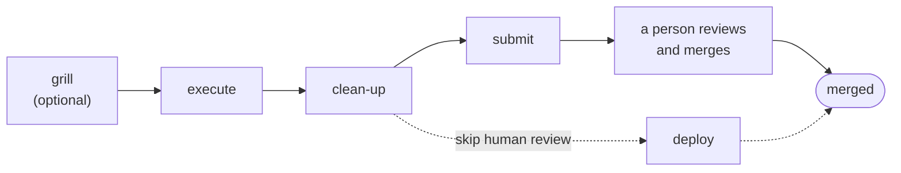

# Snappedly Skills

**Engineering workflow skills for AI coding agents.** Plan a change, build it, review it, and merge it, with the checks a careful engineer runs at each step.

[](https://github.com/snappedly/skills/actions/workflows/validate-skills.yml)
[](https://github.com/snappedly/skills/releases)
[](LICENSE)

Snappedly Skills is a collection of [Agent Skills](https://agentskills.io): Markdown instructions that your coding agent loads when a task calls for them. They work in Claude Code, Codex, and the other agents that the [Skills CLI](https://github.com/vercel-labs/skills) supports.

Each skill does one job, such as stress-testing a plan, reviewing a diff, or diagnosing an intermittent bug. The skills hand work to each other. They read your team's conventions from files in your repository, so one set of skills fits teams with different hosts, trackers, and review rules.

> [!IMPORTANT]
> These skills direct an AI agent that can edit files, run commands, push code, and merge pull requests. Read the [disclaimer](#disclaimer) before you install them.

## Quick start

1. Install the whole collection:

   ```bash
   npx skills add snappedly/skills --skill '*'
   ```

   The main workflow skills use the practice skills in the [Background](#background-practices) group, such as `code-cleanup`, `code-review`, and `pr`, and `resolving-merge-conflicts` from Upkeep. If you install only some skills, include those too.

2. In the repository you work on, type `/setup-snappedly-skills` in your coding agent. Setup asks about your code host, work tracker, and team workflow, and saves your answers in the repository.

3. Describe the change you want, then run the main workflow:

   ```text
   /grill  →  /execute  →  /clean-up  →  /submit
   ```

   A person then reviews and merges the PR. To skip that review and let the agent merge the PR itself, end with `/deploy` instead of `/submit`.

To run a skill, type its name as a command: `/grill`. Some skills, such as `setup-snappedly-skills`, `execute`, `clean-up`, `submit`, and `deploy`, start only when you type their command. Others, such as `grill`, `code-review`, and `tdd`, load automatically when a task calls for them. If you are not sure which skill fits, type `/help-snappedly`.

## The main workflow

Most work goes through four steps.



| Skill | What it does |
| --- | --- |
| `grill` | Interviews you about a plan until every open decision is settled. Skip it when the change is clear: describe what you want, let the agent propose a change, and run `execute` on that proposal. |
| `execute` | Carries out the settled plan, or a tracker issue you name, such as `/execute #42`. Substantial independent pieces run in parallel agents. Then it cleans up, reviews the result, and opens a preview. |
| `clean-up` | The final check. For an independent look, run it in a fresh session, ideally on a different model or provider. It repeats cleanup and review over everything changed on the branch, fixes clear findings, and shows what it changed. Edits stay uncommitted. |
| `submit` | Commits pending task changes first, including edits left by `clean-up`, and creates a task branch when you start on the base or default branch. Then it pushes, opens or updates the PR, marks it ready for review, and waits for its checks. A person reviews the PR and merges it: `submit` never merges, whatever your workflow records. When you run it again after review feedback, it re-requests review from each reviewer who asked for changes. It also removes the `agent-merge` label if `deploy` added it earlier. Its report lists any steps your workflow gives the agent after the merge, because no agent runs after a person merges. |
| `deploy` | Skips human review when your workflow and code host let the agent merge. It commits, pushes, opens or updates the PR, and waits for its checks as `submit` does, then merges into the branch your workflow names, closes the tickets your workflow assigns to the agent, and verifies production when your workflow asks it to. When your workflow records invocation approval, your instruction to merge is the approval, even for a merge that deploys to production. `deploy` is one way to give it: it asks you first only when content from outside your checkout entered the delivery, such as commits pushed from elsewhere or merge conflicts it resolved, and it verifies and closes out afterwards. Saying "merge this" in chat also merges, without those steps. It stops before the merge when your workflow gives the merge to a person, or when the merge would deploy to production without a recorded deployment approval gate or invocation approval. After you merge, run `deploy` again to close out. When `deploy` expects to merge the PR without waiting for anyone's review or approval, it labels the PR `agent-merge`, so reviewers can tell it apart and filter it out with `-label:agent-merge`. It removes the label whenever it stops without merging. |

Setup can record local, branch-only, or integration-branch delivery instead of a hosted PR. Then `submit` publishes the checked branch for review and leaves that workflow's delivery step to the reviewer. `deploy` follows that workflow and verifies its result. Local-only delivery does not fetch or push remote branches.

Use `build-local` when you want a browser preview of the current changes.

## All skills

Each skill lives at `skills/<group>/<name>/SKILL.md`, and the groups below follow the directories under `skills/`.

### Begin: choose and configure the workflow

| Skill | What it does |
| --- | --- |
| `help-snappedly` | Picks the skill or workflow that fits your current situation. |
| `setup-snappedly-skills` | Records your repository's code host, work tracker, team workflow, domain docs, and frontend conventions for the other skills. |

---

### Direction: explore ideas and settle design decisions

| Skill | What it does |
| --- | --- |
| `prototype` | Builds a throwaway prototype to answer a design question about logic or UI. |
| `research` | Investigates a question against primary sources and captures cited findings. |

---

### Mainflow: plan, build, check, and merge

[The main workflow](#the-main-workflow) shows how these skills fit together.

| Skill | What it does |
| --- | --- |
| `grill` | Interviews you about a plan until every open decision is settled. |
| `execute` | Carries out the settled plan or a named issue, with parallel agents where the work splits, then cleans up, reviews, and opens a preview. |
| `clean-up` | Cleans up, reviews, fixes, and shows what changed, leaving edits uncommitted. |
| `submit` | Opens or updates a PR ready for review, waits for its checks, and leaves the merge to a person. |
| `deploy` | Delivers checked changes through a hosted PR or the configured local, branch-only, or integration-branch workflow, merging without human review when your workflow allows. |

---

### Tools: standalone helpers

| Skill | What it does |
| --- | --- |
| `build-local` | Serves the current working tree at a verified local URL. |
| `retro` | Reviews a coding session and recommends evidence-backed improvements to the agent's environment. |
| `wait-what` | Explains the last message again, more clearly, when it did not land. |
| `workflow-mapping` | Maps user journeys and process scenarios, with their outcomes, logic mismatches, and missing cases. |

---

### Upkeep: maintain the codebase and triage incoming work

| Skill | What it does |
| --- | --- |
| `codebase-cleanup` | Sweeps a codebase for dead code, useless tests, unnecessary wrappers, and redundant abstractions. |
| `diagnosing-bugs` | Diagnoses uncertain, persistent, or intermittent bugs and performance regressions. |
| `improve-codebase-architecture` | Finds deepening opportunities across a codebase or around a change, and presents them as a visual HTML report. |
| `resolving-merge-conflicts` | Finishes an in-progress merge or rebase and keeps the intent of both sides. |
| `triage` | Moves issues and external PRs through triage, verifies claims, and writes agent-ready briefs. |

---

### Background: practices

The practice skills hold the standards that the other skills apply. Your agent also loads them when a task calls for them.

| Skill | What it does |
| --- | --- |
| `code-cleanup` | Cleans and validates completed changes before a commit. |
| `code-review` | Reviews a branch, PR, or working change for correctness, requirements, maintainability, and UI, with depth that matches the risk. |
| `codebase-design` | Supplies a shared vocabulary for designing deep modules and choosing where seams go. |
| `domain-modeling` | Maintains a project's domain glossary and its architecture decision records. |
| `pr` | Prepares a pull request for review, from its title and description to its commit history. |
| `remove-slop` | Removes AI-generated slop from code and prose without changing behavior or meaning. |
| `tdd` | Applies test-driven development to changed logic. It also serves as the reference for test quality and test seams. |
| `technical-writing` | Applies a layered writing standard to docs, PR descriptions, commit messages, and tickets. |
| `writing-for-agents` | Guides the writing and editing of skills and `AGENTS.md` files. |


## How the skills learn your conventions

The skills carry no project-specific policy. `setup-snappedly-skills` writes your team's choices into the repository, and the other skills read them from there:

- `docs/agents/code-host.md`: your code host, the PR title convention with its approved scopes, and the base branch protection. Setup recommends a rule that blocks direct pushes to the base branch, so every change arrives through a merged PR, which agents can still merge.
- `docs/agents/issue-tracker.md`: your work tracker. GitHub Issues is built in. For another tracker, setup records the operations your team uses.
- `docs/agents/workflow.md`: the base branch and merge strategy, when change requests open and merge, who merges and who approves the merge, when tickets and specs close, who signs off and who verifies production, and the evidence each step needs.
- `docs/agents/triage-labels.md`, `docs/agents/domain.md`, and `docs/agents/frontend.md`: triage roles, the layout of your domain docs, and your frontend conventions.

The `pr` skill titles pull requests as `type(scope): description` by default, with a scope from the approved list. If your repository has its own title convention, that convention wins.

## Update the skills

1. Update your installed skills:

   ```bash
   npx skills update
   ```

2. Rerun `setup-snappedly-skills` in each project. Setup keeps your existing conventions and shows each proposed change for your approval.

`npx skills update` updates only the skills you have installed. To add a skill a release introduced, run `npx skills add snappedly/skills --skill <name>`. It also does not uninstall a skill that a release removed. It reports the skill as failed and leaves the old copy in place. Remove it with `npx skills remove <name>`. The changelog lists the skills each release removed.

The [Skills changelog](https://docs.snappedly.com/changelog/?product=skills) lists what changed in each release. [CHANGELOG.md](CHANGELOG.md) has the full details.

## Disclaimer

Snappedly Skills is provided "as is", without warranty of any kind. You use it entirely at your own risk.

These skills are instructions for AI coding agents. Depending on how you configure and run your agent, the skills can direct it to edit and delete files, run commands, commit and push code, merge change requests, close tickets, and call external services. AI agents make mistakes, and their output can be wrong, incomplete, or insecure.

You are solely responsible for:

- Reviewing what the agent does before you rely on it.
- The permissions, credentials, and access you give the agent.
- Backups of, and the outcome for, any code, data, or systems the agent touches.
- Any costs the agent incurs, such as model or service usage.
- Complying with the laws, licenses, and policies that apply to you.

## Contributing

Contributions are welcome. Ask questions and share ideas in [Discussions](https://github.com/snappedly/skills/discussions). Read [CONTRIBUTING.md](CONTRIBUTING.md) before you open a pull request. By submitting a contribution, you agree to license it under the [MIT License](LICENSE). To report a security issue, follow [SECURITY.md](SECURITY.md).

## Credits

Skills in this collection are adapted from [Matt Pocock's skills](https://github.com/mattpocock/skills). The `remove-slop`, `technical-writing`, and `pr` skills adapt skills from the [pstack](https://github.com/cursor/plugins/tree/main/pstack) and [cursor-team-kit](https://github.com/cursor/plugins/tree/main/cursor-team-kit) Cursor plugins. The `remove-slop` skill also includes writing rules from [Humanizer](https://github.com/blader/humanizer). The `code-review` skill applies a pinned copy of the [Vercel Web Interface Guidelines](https://github.com/vercel-labs/web-interface-guidelines). All of these projects are released under the MIT License. [THIRD_PARTY_NOTICES.md](THIRD_PARTY_NOTICES.md) lists the skills that each project covers, with its copyright and license notices. Each skill folder also carries a `LICENSE.txt` with the notices that apply to it, so installed copies keep them.

## License

Snappedly Skills is released under the [MIT License](LICENSE), which contains the full warranty disclaimer and limitation of liability. You may use, copy, modify, and distribute it, including for commercial purposes, if you include the copyright notice and license text in all copies or substantial portions.
