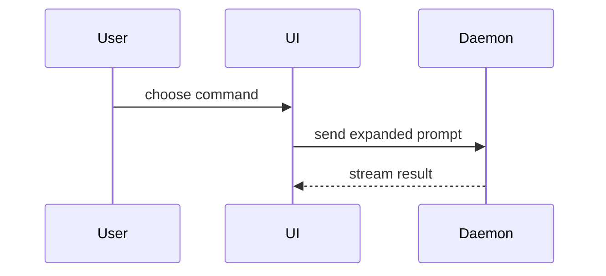

# PR

Prepare a PR so a reviewer can quickly understand the intent, important files, and risk. The default goal is reviewability without behavior changes.

Read `docs/agents/workflow.md` and, for linked work items or provider operations, `docs/agents/issue-tracker.md`, or reuse their unchanged contents. Follow the configured delivery and closure policy when creating or updating the request, including its actor, readiness, and closing-reference rules. Check existing closing references as well as new ones against ticket and parent-spec policy. Resolve missing policy before adding automatic closure or performing an otherwise undecided delivery action; continue drafting and review meanwhile. A PR-body task does not itself authorize merge or ticket closure. When those actions are in scope, follow the same policy and verify the resulting state.

## Workflow

1. Resolve the target PR from the user-provided URL or current branch. When creating a PR, use the intended head and base branches.
2. Inspect commits, diff size, changed paths, generated files, and PR description when one exists.
3. Identify reviewability issues: noisy commits, stale description, unrelated changes, mixed mechanical and logic changes, missing tests, or unclear reviewer entry points.
4. For review-only requests, assess the PR against the guidance below and return concrete findings and missing evidence without editing the PR, posting comments, or rewriting history. If `code-review` is already running, return these findings to that review; otherwise use it when correctness and maintainability review is requested.
5. When creating or updating a PR, apply safe improvements within the requested scope, then verify the tree or diff still matches the intended code. Propose a plan before rewriting history or force-pushing unless the user has already authorized it.

## Reviewer Guidance

When code behavior should stay untouched, prefer PR description and review notes:

- Add a TL;DR in the Summary that matches the actual diff.
- Separate core files from generated or mechanical files.
- Call out risky behavior changes, migration order, and rollout plan in Merge Danger, and test coverage in Evidence.
- Link issue trackers, dashboards, or design docs when they explain intent.

## PR Body

Read the repository's applicable PR/MR template and contribution guidance first. Preserve its required structure and fit the intent, evidence, and merge risk into the appropriate fields. Use the template below when no repository template governs; include a visual only when it explains the change more clearly than concise prose.

```markdown
## Summary

<TL;DR that matches the actual diff>

<optional diagram, diff-sketch, or tree>

## Evidence

- **Before:** <screenshot/output/failing test run>
  **After:** <screenshot/output/passing test run>

## Merge Danger

**Door:** <one-way or two-way>

<optional: description>

**Blast Radius:** <one-word description>

<optional: potential ramifications of merge>
```

Skip all preambles and keep prose brief. Use the user's domain language from `CONTEXT.md` when present.

### Summary

Pick the smallest view that makes the key point clear.

- Show logic or an algorithm as pseudocode:

```text
on(save)
  if content is unchanged
    return cached result
  write new content
  return fresh result
```

- Show runtime control flow as a call tree:

```text
submitForm
  createSession
    persistPrompt
    launchAgent
  navigateToSession
```

- Show UI structure as a component tree, including state and module boundaries that matter:

```text
<SessionPage> (apps/example/src/routes/session.tsx)
  useSessionEvents()
  <SessionToolbar>
    <RunSkillButton> (packages/ui)
```

- Show file responsibility or a broad refactor as a shallow file tree:

```text
src/
├── commands/       # parses user actions
├── sessions/       # owns session state
└── transport/      # sends API requests
```

- Show component interaction, control flow, or data flow with Mermaid:



- Use `diff` when the point is what changes and the surrounding shape already exists. Match the diff shape to the topic.

For a component change:

```diff
 <SessionPage>
   useSessionEvents()
   <SessionToolbar>
+    <RunSkillButton />
   <SessionTimeline>
+    <SkillResultCard />
```

For a file-layout change:

```diff
 src/
 ├── commands/
+│   └── show-me.ts       # expands the slash command
 ├── sessions/
-└── transport.ts
+└── transport/
+    ├── client.ts
+    └── stream.ts
```

For a call-tree or call-stack change:

```diff
 submitForm
   createSession
     persistPrompt
+    expandSkillMention
     launchAgent
-  navigateToSession
+  navigateToSession
+    subscribeToEvents
```

For a state or control-flow change:

```diff
 on(save)
-  write content
+  if content is unchanged
+    return cached result
+  write new content
+  invalidate cache
```

- Show the whole block when most of it is new, when omitted context would hide ownership or order, or when the user needs a copyable target shape:

```ts
function expandSkill(command: string): string {
  const skillName = command.slice(1);
  return `use the ${skillName} skill`;
}
```

#### Guidance

Place each visual next to the short text it supports. Keep only the calls, files, props, states, and boundaries needed to answer the user's current question or the options to resolve the current discussion point.

You may use one of these, you may use several, it is unlikely you will use all of them. Use your judgement and don't overwhelm the user.

### Evidence

Concrete evidence that the change works. Show a before and after. Report only evidence actually observed; state when before evidence or execution results are unavailable.

Screenshots are S-tier - when the environment is set up for it and the change is visual.

Execution-based evidence is A-tier. Test results, console output. Show the exact test that now fails and passes, using pseudocode.

### Merge Danger

Describe whether it's a one-way or two-way door. You can walk back through two-way doors, but not one-way doors. A PR that is cheap to roll back is lower risk. Changes that involve destructive actions or hard-to-reverse decisions are one-way doors.

The blast radius is the potential impact or scope of the changes introduced by this PR. Consider all possibilities. Examples are layout shift, breakages for consumers, mobile responsiveness, etc.

Assess reversibility of effects as well as code: reverting a commit may not restore deleted data, reverse a migration, or undo messages already sent. Use the spec and rollout context to state any recovery limits.

## History Cleanup

Only rewrite history when the user asks for it or agrees to the plan. Before rewriting:

```bash
gh pr view <PR> --json title,headRefName,baseRefName,state,commits
git fetch origin <headRefName> <baseRefName>
ORIGINAL_TREE=$(git rev-parse origin/<headRefName>^{tree})
```

Good commit groupings usually follow dependency order:

1. Schema/storage or generated API definitions.
2. Core logic.
3. Wiring and integration.
4. UI or surface behavior.
5. Tests.

After rewriting, verify content identity:

```bash
echo "Original tree: $ORIGINAL_TREE"
echo "Current tree:  $(git rev-parse HEAD^{tree})"
git diff origin/<headRefName> --stat
```

Do not push if the tree changed unintentionally.

## Guardrails

- Never hide meaningful behavior changes inside "cleanup".
- Do not bypass hooks unless the user explicitly asks.
- If the PR is too large to make reviewable with notes, recommend splitting instead of polishing around the problem.
